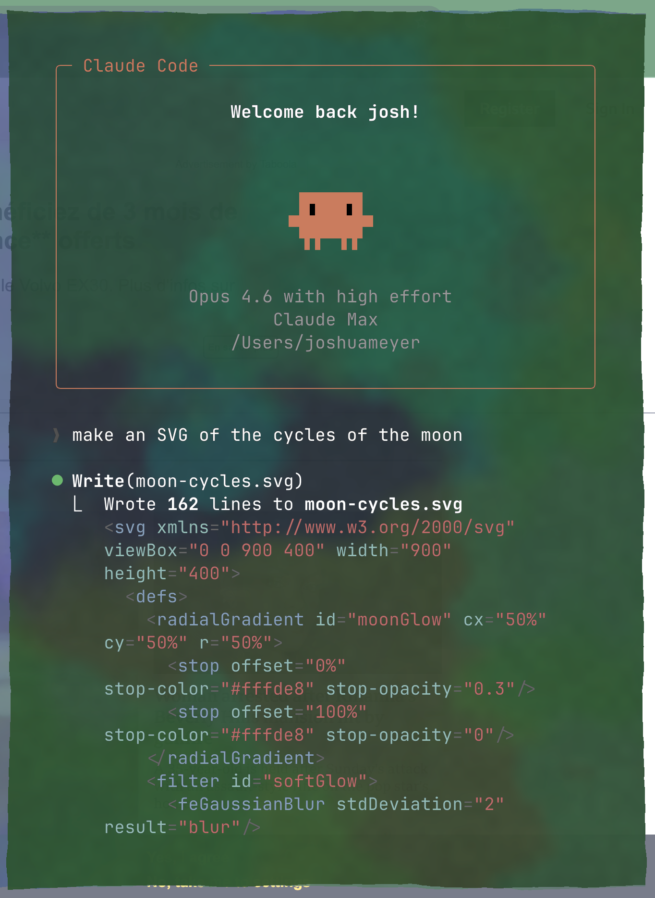
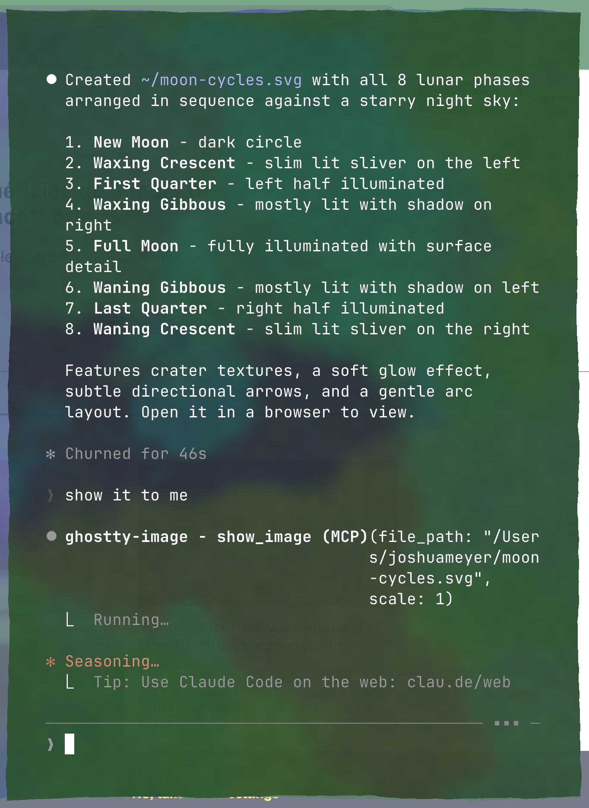
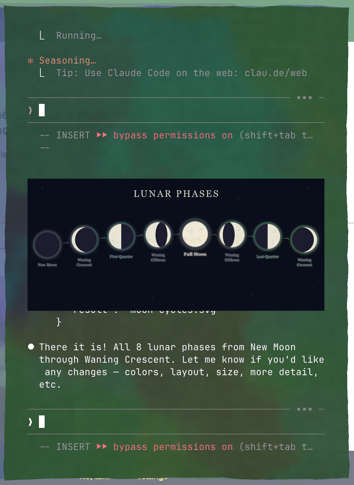

# ghostty-image-mcp

An MCP server that displays images inline in [Ghostty](https://ghostty.org/) using the [Kitty graphics protocol](https://sw.kovidgoyal.net/kitty/graphics-protocol/).

Built for use with [Claude Code](https://docs.anthropic.com/en/docs/claude-code), but works with any MCP client running in a Kitty-compatible terminal.

<p align="center">
  
  
  
</p>

## Features

- Display images directly in the terminal (PNG, JPEG, SVG, PDF, and more)
- PDF support with page selection (`page` parameter, 1-indexed)
- Adjustable scale (10%–100% of terminal width)
- Automatic centering in the terminal
- Automatic format conversion to PNG via `sips` (macOS), `rsvg-convert` (SVG), and CoreGraphics (PDF)
- Unique image IDs so multiple images coexist in terminal scrollback
- No escape sequence leaks (`q=2` suppresses all protocol responses)

## Requirements

- macOS (uses `sips` for image conversion)
- Python 3.10+
- [uv](https://docs.astral.sh/uv/)
- A Kitty graphics protocol-compatible terminal ([Ghostty](https://ghostty.org/), [Kitty](https://sw.kovidgoyal.net/kitty/), etc.)
- `rsvg-convert` (optional, for SVG support — install via `brew install librsvg`)

## Setup

1. Clone this repo:

```bash
git clone https://github.com/jrmeyer/ghostty-image-mcp.git
```

2. Add to your Claude Code config. Run:

```bash
claude mcp add ghostty-image -- uv run /path/to/ghostty-image-mcp/server.py
```

Or manually add to `~/.claude.json`:

```json
{
  "mcpServers": {
    "ghostty-image": {
      "type": "stdio",
      "command": "uv",
      "args": ["run", "/path/to/ghostty-image-mcp/server.py"]
    }
  }
}
```

3. Restart Claude Code.

## Usage

From Claude Code, ask it to display an image:

```
show me ~/photos/cat.jpg
```

The `show_image` tool accepts:
- `file_path` — path to the image file (PNG, JPEG, SVG, PDF, or any format `sips` can convert)
- `scale` — fraction of terminal width to use (0.1–1.0, default 0.75)
- `page` — page number for PDFs (1-indexed, defaults to 1)

## How it works

The server captures the controlling TTY at startup (before MCP stdio transport takes over), then writes Kitty graphics protocol escape sequences directly using raw file descriptor I/O (`os.write`). It uses file-based transfer (`t=f`) — the terminal reads the PNG file directly from disk via a single small escape sequence. Each image gets a unique ID so multiple images can coexist in terminal scrollback without evicting each other. `q=2` suppresses terminal acknowledgment responses, which prevents escape sequence text from leaking into TUI applications like Claude Code.

## Known limitations

- **Ghostty image memory limit**: Ghostty caps the number/size of images kept in scrollback. When displaying many high-resolution images (e.g., pages of a large PDF), older images may disappear as new ones are added. Smaller or compressed images allow more to coexist in scrollback at once.
- **`t=t` (temp file transfer) not supported**: Ghostty does not support the Kitty `t=t` transfer mode. This server uses `t=f` (file transfer) instead, where the terminal reads the file from disk but does not delete it.
